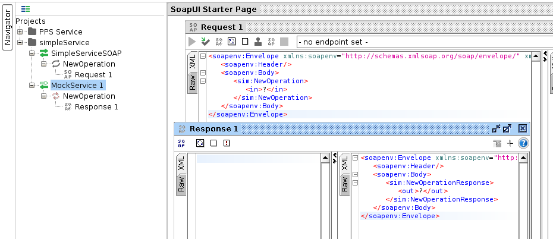

# camel-webservice-mock

Simple example to show how to mock a SOAP webservice with static/random responses with camel.

This project was initially constructed using the camel-springboot-archetype, it is Openshift ready :)

```text
mvn org.apache.maven.plugins:maven-archetype-plugin:2.4:generate \
  -DarchetypeCatalog=https://maven.repository.redhat.com/ga/io/fabric8/archetypes/archetypes-catalog/2.2.195-redhat-000016/archetypes-catalog-2.2.195.redhat-000016-archetype-catalog.xml \
  -DarchetypeGroupId=org.jboss.fuse.fis.archetypes \
  -DarchetypeArtifactId=spring-boot-camel-xml-archetype \
  -DarchetypeVersion=2.2.195.redhat-000016
```

This set of dependencies were added for cxf and groovy

```xml
    <dependency>
      <groupId>org.apache.cxf</groupId>
      <artifactId>cxf-spring-boot-starter-jaxws</artifactId>
    </dependency>
    <dependency>
      <groupId>org.apache.camel</groupId>
      <artifactId>camel-cxf-starter</artifactId>
    </dependency>
    <dependency>
      <groupId>org.apache.camel</groupId>
      <artifactId>camel-cxf-transport</artifactId>
    </dependency>
    <dependency>
      <groupId>org.apache.camel</groupId>
      <artifactId>camel-script</artifactId>
    </dependency>
    <dependency>
      <groupId>org.apache.camel</groupId>
      <artifactId>camel-groovy</artifactId>
    </dependency>
```

## SOAP UI

Use soapUI to generate a mock webservice and manually construct some responses



Then add the responses and the WSDL was added to the project.

The main route selects a random numbered response from the classpath.

```xml
<route>
    <from uri="cxf:bean:simpleServiceEndpoint?dataFormat=MESSAGE"/>
    <setHeader headerName="randomResponse">
        <simple>random(1,6)</simple>
    </setHeader>
    <setBody>
        <groovy>this.getClass().getResource( "/response/response${request.headers.randomResponse}.xml" ).text</groovy>
    </setBody>
</route>
```